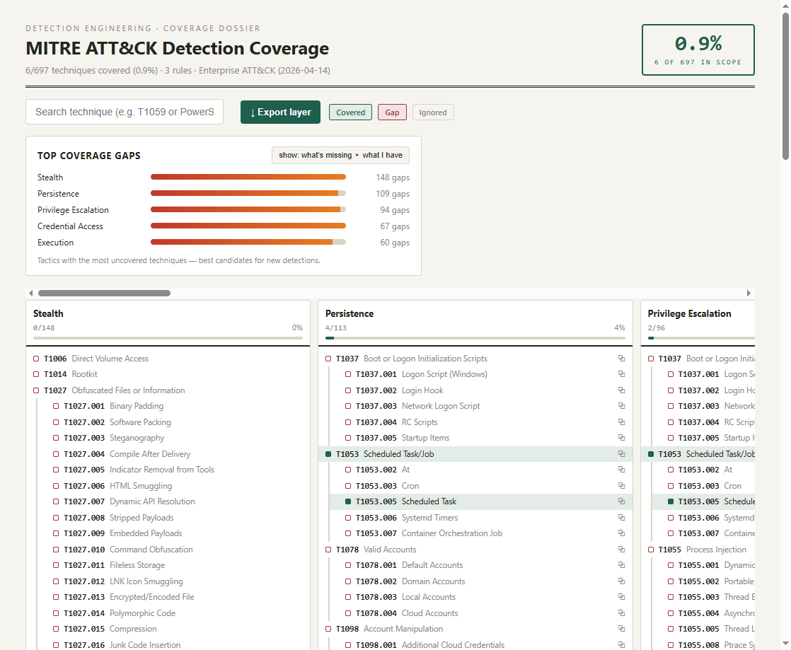
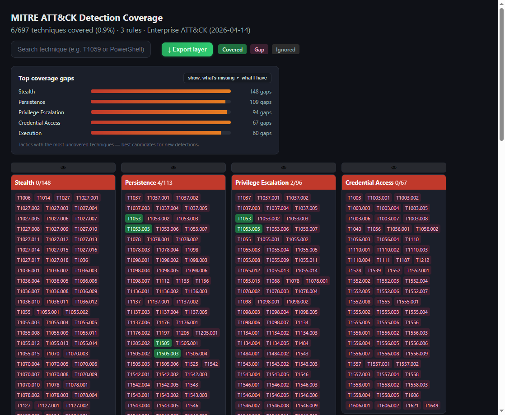

# attack-mapper 🎯

[](https://github.com/JoseArgento/attack-mapper/actions/workflows/ci.yml)
[](https://github.com/JoseArgento/attack-mapper/actions/workflows/update-attack-db.yml)
[](https://pypi.org/project/attack-mapper/)
[](LICENSE)

Map your **Sigma detection rules** onto the **MITRE ATT&CK** matrix and find your
coverage gaps — fast, offline, and CI-friendly.

Part of a detection-engineering toolkit that pairs perfectly with a
*Detection-as-Code* pipeline (Sigma → CI → SIEM). It answers the question every
blue team eventually asks: *"Which ATT&CK techniques do my rules actually
cover, and where are the blind spots?"*

## Features

- 🔍 Extracts ATT&CK technique IDs from Sigma rules via:
  - canonical `attack.<id>` tags,
  - raw `T1059` tags,
  - `attack.mitre.org/techniques/...` URLs in `references:`.
- 📊 Per-tactic coverage bars + overall coverage ratio in the terminal.
- 🎨 **Four HTML styles** to show off your coverage:
  - `matrix` (default) — tactic cards with technique chips,
  - `rows` — compact tactic progress bars,
  - `heat` — dense heatmap of every technique,
  - `report` — print-ready dossier with canonical vertical ATT&CK columns
    and sub-techniques nested under their parents (PDF it for audits/portfolio).
- 🟢 Covered techniques (incl. parent techniques of covered sub-techniques)
  render green; gaps render red; explicitly ignored ones render grey.
- 🔎 **Scope filters** — `--include` and `--ignore` narrow the analysis to the
  techniques/tactics you care about (or exclude the ones you don't). The active
  scope is shown in the report so readers know what was filtered.
- 🏅 **Portfolio badge** (`--badge`) — a shields.io-style SVG coverage badge.
- 🧾 **JSON summary** (`--json`) — machine-readable output for dashboards/CI.
- 🧭 **ATT&CK Navigator export** — every HTML report embeds an
  "Export layer" button that downloads a ready-to-import Navigator layer.
- 🧱 Uses the **real MITRE ATT&CK enterprise dataset** (v19 structure:
  Stealth + Defense Impairment). Revoked/deprecated techniques are
  filtered out so the coverage denominator matches the official matrix
  (15 tactics, 222 techniques, 475 sub-techniques). Shipped as a compact
  JSON, no network needed at runtime.
- ✅ Pure Python stdlib + `pyyaml`; tiny dependency footprint.
- 🤖 Non-zero exit when nothing maps → use it as a **CI gate** in your
  detection repo.

## Screenshots

| `report` (print-ready dossier) | `matrix` (cards) |
| --- | --- |
|  |  |

## Install

```bash
pip install attack-mapper
```

For development:

```bash
python -m venv .venv && source .venv/bin/activate
pip install -e ".[dev]"
pytest
```

## Usage

```bash
# Map a folder of Sigma rules, print the terminal report, emit HTML (matrix)
attack-mapper rules/ --html sample/coverage_matrix.html

# Try the other HTML styles
attack-mapper rules/ --html sample/coverage_rows.html  --style rows
attack-mapper rules/ --html sample/coverage_heat.html  --style heat
attack-mapper rules/ --html sample/coverage_report.html --style report

# Scope the analysis: only Execution + T1053, ignore Reconnaissance
attack-mapper rules/ --include T1059 TA0002 --ignore Reconnaissance

# Portfolio artifacts: badge + JSON
attack-mapper rules/ --badge sample/coverage_badge.svg --json sample/coverage.json
```

Run against the bundled sample rules:

```bash
attack-mapper rules/ --html sample/coverage_matrix.html --badge sample/coverage_badge.svg
```

## Why not sigma2attack or DeTT&CT?

Both are excellent and you should know they exist. **sigma2attack** (from the
Sigma tooling) converts Sigma rules into an ATT&CK Navigator heatmap layer —
if all you need is a layer file, it does the job. **DeTT&CT** is the
heavyweight: it scores data-source *visibility* as well as detection
coverage, and is the right tool for a mature SOC doing formal capability
assessments.

attack-mapper sits in between, optimized for Detection-as-Code pipelines:
it runs offline with a bundled dataset, produces self-contained HTML
reports you can email or print (plus the Navigator layer, a badge, and
JSON), gates CI with its exit code, and supports scope filters for
counting only the techniques relevant to your environment. It is also
**ATT&CK v19-native** (Stealth + Defense Impairment) with a scheduled
workflow that flags future MITRE updates automatically.

## How it works

```
Sigma rules ──▶ sigma_parser ──▶ technique IDs
                                    │
ATT&CK DB  ──▶ attack_loader       │
                                    ▼
            coverage.build_report (with --include/--ignore) ──▶ CoverageReport
                                    │
            renderers (terminal / HTML matrix|rows|heat)
            plugins  (badge SVG / JSON)
```

## Scope filters

`--include` and `--ignore` accept technique IDs (e.g. `T1059`), sub-technique
prefixes (e.g. `T1059` also covers `T1059.001`), tactic shortnames
(e.g. `execution`) or tactic IDs (e.g. `TA0002`). A covered technique is always
recorded as covered even if it falls outside an `--include` scope, but only
in-scope covered techniques count toward the coverage ratio (both numerator
and denominator are scoped).

## Updating the ATT&CK dataset

The shipped `attack_mapper/data/attack_db.json` is a snapshot (regenerated
automatically by a monthly GitHub Action that fails when MITRE ships an update). To regenerate from the latest
official STIX bundle:

```bash
curl -L -o enterprise-attack.json \
  https://raw.githubusercontent.com/mitre/cti/master/enterprise-attack/enterprise-attack.json
ATTACK_MAPPER_STIX=enterprise-attack.json python -m attack_mapper.build_db
```

You can also run directly off the STIX bundle at runtime by setting
`ATTACK_MAPPER_STIX`.

## Project layout

```
attack-mapper/
├── attack_mapper/
│   ├── cli.py            # argparse entry point
│   ├── sigma_parser.py   # Sigma → ATT&CK technique IDs
│   ├── attack_loader.py  # ATT&CK DB (compact JSON / STIX)
│   ├── coverage.py       # coverage + gaps + scope filters
│   ├── renderers.py      # terminal table + 4 HTML styles
│   ├── plugins.py        # badge SVG + JSON summary
│   ├── build_db.py       # regenerate the compact ATT&CK DB
│   └── data/attack_db.json  # real ATT&CK (compact, ships with the package)
├── rules/                # sample Sigma rules
├── sample/               # generated HTML / badge / JSON examples
├── tests/                # pytest suite
└── pyproject.toml
```

## License

MIT
